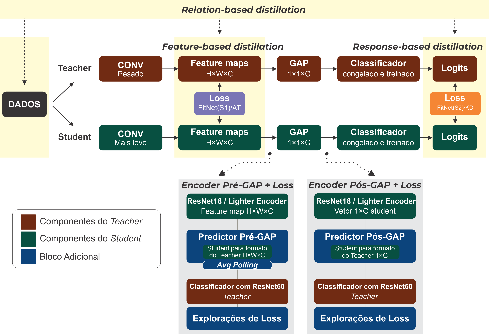

INSTITUTO DE COMPUTAÇÃO - UNICAMP

Deep Learning - MO434

Prof. Dr. Alexandre Xavier Falcão

# **A Comparative Study of Knowledge Distillation Schemes from Pretrained Image Classifiers into a Lightweight ConvNet**

**Aluna:** Maiara Araujo Damião - RA 291674

IC/UNICAMP (2026)

---

## Sobre o Projeto

Este projeto implementa e compara **seis esquemas de destilação de conhecimento** (Knowledge Distillation – KD) para transferir o conhecimento de um classificador de imagens pré-treinado (*teacher*) para uma rede mais leve (*student*). O objetivo é reduzir custo computacional e número de parâmetros mantendo alta acurácia.

São exploradas duas variantes do *predictor* (pré-GAP e pós-GAP) e dois *students*: um *ResNet18* e um *encoder* personalizado (*Lighter Encoder*), ambos treinados para imitar as representações do *teacher* (*ResNet50*).

---

## Demonstração On-line

Uma versão interativa do projeto está disponível em: [https://maiaraujo.com.br/mo434-online/](https://maiaraujo.com.br/mo434-online/)
Essa página web permite comparar em tempo real o comportamento do modelo **Teacher (ResNet50)** e comparar com os modelos **Student** treinados, assim vendo o resultado do tempo de inferência de cada um. Inicialmente somente converti os modelos .pth em .onnx para pré-GAP e no dataset [Natural Images](https://www.kaggle.com/datasets/prasunroy/natural-images).

---

## Datasets Utilizados

| Dataset | Classes | Imagens | Fonte |
|---------|---------|---------|-------|
| **Natural Images** | 8 | 6.899 | [Kaggle](https://www.kaggle.com/datasets/prasunroy/natural-images) |
| **Garbage Classification** | 12 | 15.150 | [Kaggle](https://www.kaggle.com/datasets/mostafaabla/garbage-classification) |

- **Natural Images**: imagens de objetos cotidianos (avião, carro, gato, cachorro, flor, fruta, motocicleta, pessoa). Domínio próximo ao ImageNet.
- **Garbage Classification**: resíduos recicláveis e lixo (bateria, vidro, papel, plástico, etc.). Domínio mais específico e ruidoso.

---

## Teacher

- **Arquitetura:** ResNet50 (pré-treinada no ImageNet)
- **Parâmetros:** ~25,6 M
- **GFLOPs:** 4,13
- **Fine-tuning:** O *encoder* foi congelado e apenas o classificador foi re-treinado com **MSE + Adam** por 10 épocas, preservando o conhecimento ImageNet. A escolha **MSE + Adam** se deu por testar todas as variações de otimizadores e loss e essa foi a melhor.

---

## Students

### 1. ResNet18
- Pré-treinada no ImageNet.
- Parâmetros: aproximadamente 11,2 M
- GFLOPs: 1,82

### 2. Lighter Encoder (projetado do zero)
- **Sem pré-treinamento**, sem *skip connections*.
- Camadas convolucionais com stride=2 para reduzir resolução até 7×7.

---

## Predictors (Pré-GAP vs. Pós-GAP)

O *student* produz representações de dimensão `(B, 512, 1, 1)`. O *teacher* (ResNet50) produz `(B, 2048, 7, 7)` antes do GAP e `(B, 2048)` depois.

---

## Funções de Perda (Loss Functions) Avaliadas

Seis métodos de destilação foram comparados, cada um com sua própria função de perda:
- **KD (Hinton)**
- **FitNet**
- **AT (Attention Transfer)**
- **RKD (Relational KD)**
- **MSE+CE**
- **MSE sem CE**

---

## Pipeline Geral

A figura abaixo ilustra a arquitetura completa do experimento: em vermelho os componentes do *teacher* (ResNet50), em verde os do *student* (encoder + predictor) e em azul os blocos adicionais para cada método de destilação.

---

### Notebooks principais:
- **ResNet18 (pré-GAP):** `Maiara_Araujo_MO434_TrabalhoFinal_291674.ipynb`
- **Lighter Encoder (pré-GAP):** `Maiara_Araujo_MO434_TrabalhoFinal_291674_LighterEncoder.ipynb`
- **Pós-GAP** (ambos): arquivos com prefixo `POSTGAP_`
- **Análise comparativa:** `MO434_Analise_Comparativa_Modelos.ipynb`
- **Melhor modelo (100 épocas):** `Maiara-Araujo_MO434_TrabalhoFinal_291674-MelhorLighterEncoder.ipynb`
- **Análise comparativa (100 épocas):** `MO434_Analise_Comparativa_Modelos_ISOLADAS_MAIS_EPOCHS.ipynb`